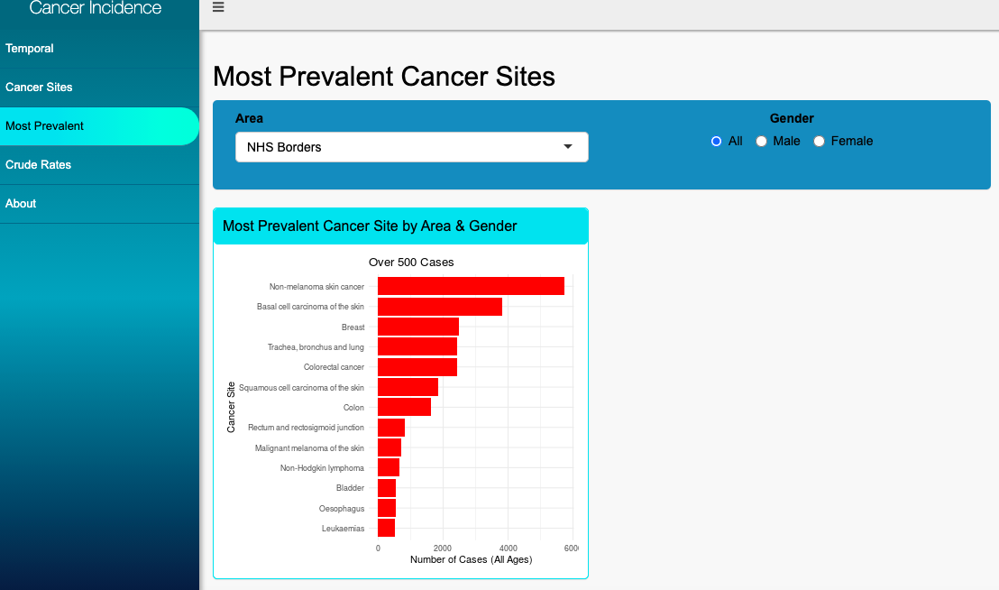
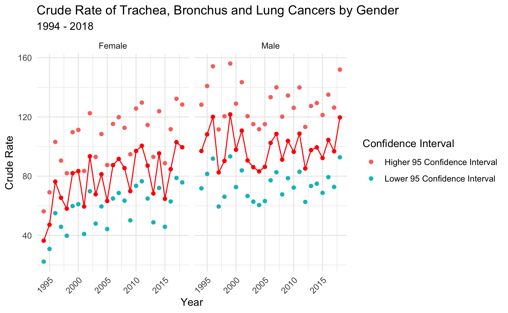

# Cancer Incidence in Scotland  
by Stephanie Duncan  
23/02/2021

A personal project I have been working on recently is creating a dashboard for Cancer Incidence in Scotland.

I used R Shiny to build an interactive web app to show my analysis in a user-friendly way.

Link to Cancer Incidence app:- https://stephanieduncan.shinyapps.io/cancer_rates/

Some analysis on cancer incidence in NHS Borders can be seen below.

# Cancer Incidence in NHS Borders  
by Stephanie Duncan  
04/02/2021

Analysis has been carried out on a dataset from NHS Scotland, in order to give insights into the incidence of cancer in the NHS Borders in 1994 - 2018. 

In order to help the NHS to plan the provision of cancer treatment services, a variety of data visualisations were created to understand the following:

1. Cancer incidence over time
2. Trends in incidence by gender 
3. Most prevalent cancer sites
4. Comparison of NHS Borders to the rest of the Scottish Health Boards
5. Crude Rate of Trachea, Bronchus and Lung Cancers by Gender

## Cancer Incidence Over Time

From the plot, it can be seen that cancer incidence has increased overall from 1994 to 2018, however there is some irregularity. There were 518 incidences in 1994, compared to 828 incidences in 2018 - an increase by 59.8%.

## Trends in Incidence by Gender

Analysis on the incidence of cancer by gender shows that incidence is higher in females than males. However, in 2017, males had the highest incidence of cancer of all years where the figure surpassed 450 patients. As can be seen from the female graph, there is a spike in the incidence of cancer almost every three years. 

## The Most Prevalent Cancer Sites
### Where incidence is over 500 cases

The most prevalent cancer sites for NHS Borders are:-

1. Non-melanoma skin cancer
2. Basal cell carcinoma of the skin
3. Breast 
4. Trachea, bronchus and lung
5. Colorectal cancer

## Most Prevalent Cancer Sites in Females
### Where incidence is over 100 cases

The graph shows that the most prevalent cancer site for females is Breast Cancer (almost 2,500 cases), closely followed by Non-melanoma skin cancer. For females, there are a total of 30 variations of cancer sites where there are over 100 patient cases.

## The Most Prevalent Cancer Sites in Males
### Where incidence is over 100 cases

For males, the most prevalent cancer site is Non-melanoma skin cancer. This was also high for females (2411 cases), however there is a much higher incidence in males (3330 cases). For males, there are a total of 25 cancer sites where incidence is over 100 patient cases.

## Comparison of NHS Borders to the rest of the Scottish Health Boards

As can be seen from the plot, cancer incidence in the NHS Borders is low when compared to other parts of Scotland as a whole, possibly due to population density.

## Crude Rate of Trachea, Bronchus and Lung Cancers by Gender

Analysis on the crude rate of Trachea, Bronchus and Lung Cancers by gender shows that the rate is much higher for males than for females. The crude rate has remained consistently high for males, whereas for females the rate has increased dramatically over time.

## Conclusions
1. Cancer incidence has increased during 1994 - 2018.
2. For females, there is a spike in the incidence of cancer every three years due to three year screening cycles.
3. Non-melanoma skin cancer is extremely high for both genders.
4. The crude rate of Trachea, Bronchus and Lung Cancers is higher for males, however more recently the rate for females, which was low in 1994, has increased to the point where the rate is now closely lagging behind males.

## Data Sources:- 

Cancer incidence data - https://www.opendata.nhs.scot/dataset/annual-cancer-incidence

Geography health board labels lookup - https://www.opendata.nhs.scot/dataset/9f942fdb-e59e-44f5-b534-d6e17229cc7b/resource/652ff726-e676-4a20-abda-435b98dd7bdc/download/geography_codes_and_labels_hb2014_01042019.csv
